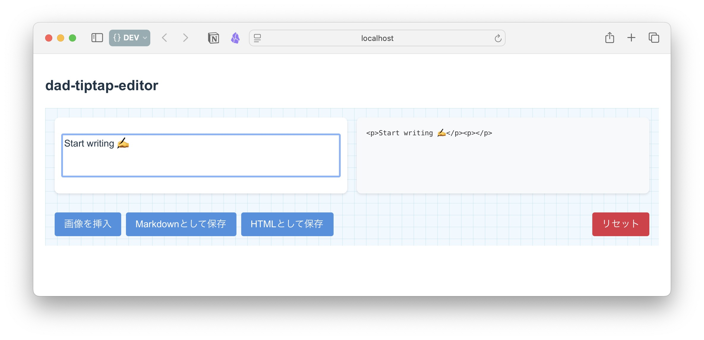

# dad-tiptap-editor
  

  
#### マークダウン記法で入力可能な簡易エディタです
  
## INSTALLATION
  
（ターミナルから）任意のディレクトリで以下をコマンドします
  
```bash
git clone https://github.com/watanabe3ti/dad-tiptap-editor.git
cd dad-tiptap-editor
npm install
```
  
## USAGE
  
dad-tiptap-editor ディレクトリで（ターミナルから）以下をコマンドします
```bash
npm run dev
```
  
ブラウザで、localhost:3000 にアクセスしてください
  
使用を終えるときは
（ターミナルから）Control+C を入力してください
  
なお、r＋Enter で再起動します
  
  
---
> .&- エージェントは、中学生にもわかるように説明しています
  
---